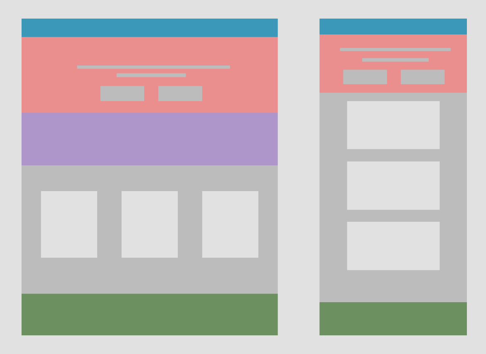

# bootstrap-starter-template

A simple starter template of Bootstrap.

## To Get Started

`git clone` repository

## Bootstrap Starter Template

[Go here to get template](https://getbootstrap.com/docs/4.5/getting-started/introduction/#starter-template)

_We recommend to use version 4.5 since we're using it_

## Theme

**Pink**  
 `#ea8485`  
**Dark Pink**  
 `#cda8a8`  

## Wireframe

